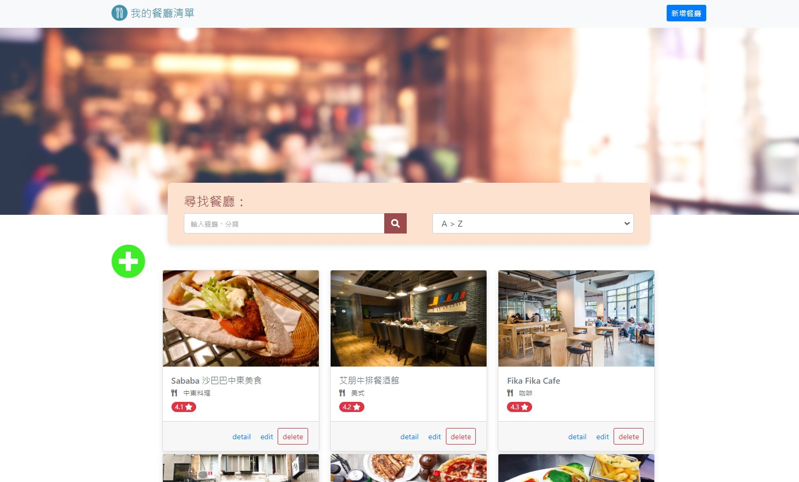
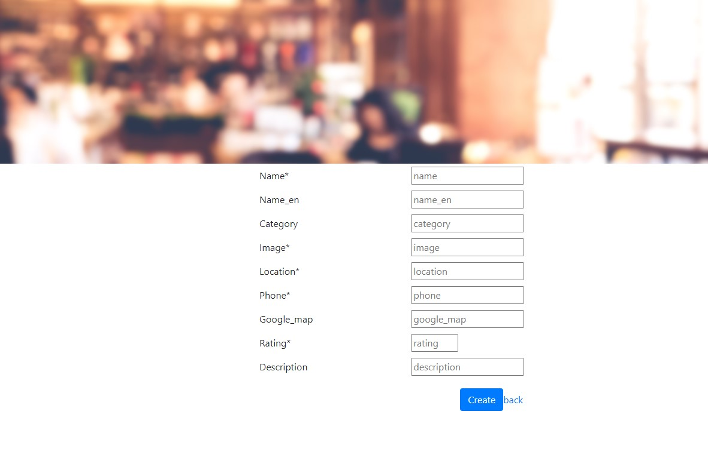

# S2-3_A1_我的餐聽清單
用來蒐集喜愛餐廳資料的網站



 ## Features 產品功能
  * 使用者可以在首頁看到所有餐廳與它們的簡單資料
  * 使用者可以再點進去看餐廳的詳細資訊
  * 使用者可以透過搜尋餐廳名稱來找到特定的餐廳
  * 使用者可以透過搜尋餐廳類別來找到特定的餐廳

 

# Getting Started

 ## Built With 環境與套件
  * Node.js
  * Nodemon
  * Express 4.16.4
  * express-handlebars 3.0.0
  * fontawesome 5.8.1
  * bootstrap 4.3.1
  * popper.js 1.14.7


 ## Installing 如何安裝
  ### 1.開啟終端機terminal，複製此專案至本地端
  ```
  git clone https://github.com/azragel/restaurantList.git
  ```

  ### 2.進入專案資料夾
  ```
  cd [專案資料夾]
  ```

  ### 3.安裝專案使用套件(會依package.json內容安裝)
  ```
  npm install 
  ```

  ### 4.安裝nodemon套件
  ```
  npm install nodemon
  ```
  ### 5.啟動伺服器
  ```
  nodemon app.js
  ```
  終端機顯示restaurant server is now active on http://localhost:3000 表示成功啟動

  ### 6.在瀏覽器上鍵入網址 http://localhost:3000/
  開始使用網站
  

# Authors 開發人員
[Robert Liu](https://github.com/azragel)

# Acknowledgments 感謝
Alpha Camp 


